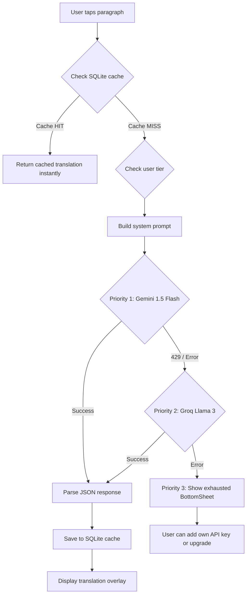

# L-Mutarjim AI — Implementation Plan

> A high-performance Flutter ePub reader and AI translator with smart multi-LLM fallback, offline caching, and tiered business models.

---

## 1. Architecture Overview

**Pattern:** Feature-first Clean Architecture with Repository Pattern  
**State Management:** flutter_bloc (Cubit) — robust, well-tested for complex async flows  
**DI:** get_it + injectable  
**Routing:** go_router  

```
lib/
├── core/                          # Shared infrastructure
│   ├── constants/
│   │   └── app_constants.dart     # API URLs, default keys, tier limits
│   ├── di/
│   │   └── injection.dart         # get_it service locator setup
│   ├── error/
│   │   ├── failures.dart          # Failure sealed classes
│   │   └── exceptions.dart        # Custom exception types
│   ├── theme/
│   │   ├── app_theme.dart         # Dark/Light premium themes
│   │   └── app_colors.dart        # Curated color palette
│   ├── utils/
│   │   ├── hash_utils.dart        # SHA-256 paragraph hashing
│   │   └── isolate_utils.dart     # Isolate helpers for heavy parsing
│   └── network/
│       └── dio_client.dart        # Dio instance with interceptors
│
├── features/
│   ├── library/                   # Book library & file picker
│   │   ├── data/
│   │   │   ├── datasources/
│   │   │   │   └── local_book_datasource.dart
│   │   │   ├── models/
│   │   │   │   └── book_model.dart
│   │   │   └── repositories/
│   │   │       └── library_repository_impl.dart
│   │   ├── domain/
│   │   │   ├── entities/
│   │   │   │   └── book.dart
│   │   │   ├── repositories/
│   │   │   │   └── library_repository.dart
│   │   │   └── usecases/
│   │   │       ├── import_book.dart
│   │   │       └── get_books.dart
│   │   └── presentation/
│   │       ├── cubit/
│   │       │   ├── library_cubit.dart
│   │       │   └── library_state.dart
│   │       ├── pages/
│   │       │   └── library_page.dart
│   │       └── widgets/
│   │           └── book_card.dart
│   │
│   ├── reader/                    # ePub reader & paragraph extraction
│   │   ├── data/
│   │   │   ├── datasources/
│   │   │   │   └── epub_parser_datasource.dart
│   │   │   ├── models/
│   │   │   │   ├── chapter_model.dart
│   │   │   │   └── paragraph_model.dart
│   │   │   └── repositories/
│   │   │       └── reader_repository_impl.dart
│   │   ├── domain/
│   │   │   ├── entities/
│   │   │   │   ├── chapter.dart
│   │   │   │   └── paragraph.dart
│   │   │   ├── repositories/
│   │   │   │   └── reader_repository.dart
│   │   │   └── usecases/
│   │   │       ├── get_chapters.dart
│   │   │       └── get_paragraphs.dart
│   │   └── presentation/
│   │       ├── cubit/
│   │       │   ├── reader_cubit.dart
│   │       │   └── reader_state.dart
│   │       ├── pages/
│   │       │   └── reader_page.dart
│   │       └── widgets/
│   │           ├── chapter_drawer.dart
│   │           ├── paragraph_tile.dart
│   │           └── translation_overlay.dart
│   │
│   ├── translation/               # AI translation engine
│   │   ├── data/
│   │   │   ├── datasources/
│   │   │   │   ├── gemini_datasource.dart
│   │   │   │   ├── groq_datasource.dart
│   │   │   │   └── translation_cache_datasource.dart
│   │   │   ├── models/
│   │   │   │   └── translation_model.dart
│   │   │   └── repositories/
│   │   │       └── translation_repository_impl.dart
│   │   ├── domain/
│   │   │   ├── entities/
│   │   │   │   └── translation.dart
│   │   │   ├── repositories/
│   │   │   │   └── translation_repository.dart
│   │   │   └── usecases/
│   │   │       └── translate_paragraph.dart
│   │   └── presentation/
│   │       ├── cubit/
│   │       │   ├── translation_cubit.dart
│   │       │   └── translation_state.dart
│   │       └── widgets/
│   │           ├── translation_bubble.dart
│   │           └── exhausted_bottom_sheet.dart
│   │
│   └── settings/                  # Settings, API keys, tier management
│       ├── data/
│       │   ├── datasources/
│       │   │   └── settings_local_datasource.dart
│       │   └── repositories/
│       │       └── settings_repository_impl.dart
│       ├── domain/
│       │   ├── entities/
│       │   │   └── user_settings.dart
│       │   ├── repositories/
│       │   │   └── settings_repository.dart
│       │   └── usecases/
│       │       ├── get_settings.dart
│       │       └── save_api_key.dart
│       └── presentation/
│           ├── cubit/
│           │   ├── settings_cubit.dart
│           │   └── settings_state.dart
│           └── pages/
│               └── settings_page.dart
│
├── app.dart                       # MaterialApp + GoRouter setup
└── main.dart                      # Entry point + DI init
```

---

## 2. Technology Decisions

| Concern | Choice | Rationale |
|---|---|---|
| **ePub Parsing** | `epubx` + `html` | Pure Dart, no native deps, gives raw HTML we can parse into paragraphs with `<p>` extraction. We build our own reader UI for full control. |
| **ePub Rendering** | Custom `ListView` (not a WebView viewer) | We need paragraph-level granularity for tap-to-translate. WebView-based viewers (vocsy, flutter_epub_viewer) don't expose individual paragraphs. |
| **Gemini API** | `google_generative_ai` package | Direct SDK access. API key passed via `--dart-define` for dev, stored in `flutter_secure_storage` for Pro/BYOK tier. |
| **Groq API** | `dio` REST calls | OpenAI-compatible endpoint at `https://api.groq.com/openai/v1/chat/completions`. Simple HTTP. |
| **Local DB** | `sqflite` | Per user spec. Schema for translation caching with paragraph hash lookup. |
| **Secure Storage** | `flutter_secure_storage` | For BYOK API keys (Pro tier). |
| **File Picker** | `file_picker` | Cross-platform ePub file selection. |

> [!IMPORTANT]
> **Why custom reader instead of a viewer package?** The core requirement is paragraph-by-paragraph translation with tap-to-translate. Existing viewer packages render ePub inside WebViews/native containers and don't expose individual paragraph elements to Flutter. By parsing with `epubx` and rendering with our own `ListView`, we get full control over each paragraph widget — enabling tap gestures, translation overlays, and caching per paragraph.

---

## 3. Core Service: TranslationService & PriorityManager

This is the heart of the app — a centralized service that orchestrates multi-LLM translation with caching and fallback.

### Flow Diagram



### System Prompt (exact)

```
You are a professional literary translator. Translate the following paragraph 
into [Target Language]. Maintain the soul and emotional tone of the text, 
use natural linguistic flow, and strictly avoid literal translation. 
Return the result in a JSON format: {"original": "...", "translation": "..."}.
```

### PriorityManager Logic

```dart
class PriorityManager {
  // Ordered list of providers
  final List<TranslationProvider> _providers;
  
  Future<Translation> translate(String text, String targetLang) async {
    for (final provider in _providers) {
      try {
        return await provider.translate(text, targetLang);
      } on RateLimitException {
        continue; // Try next provider
      } on ApiException {
        continue; // Try next provider
      }
    }
    throw AllProvidersExhaustedException();
  }
}
```

---

## 4. SQLite Schema

```sql
CREATE TABLE translations (
    id           INTEGER PRIMARY KEY AUTOINCREMENT,
    book_id      TEXT NOT NULL,
    paragraph_hash TEXT NOT NULL,    -- SHA-256 of original text
    original_text  TEXT NOT NULL,
    translated_text TEXT NOT NULL,
    language_pair  TEXT NOT NULL,    -- e.g., "en_ar", "fr_en"
    provider      TEXT,             -- "gemini", "groq", "gpt4o"
    created_at    INTEGER NOT NULL,
    UNIQUE(book_id, paragraph_hash, language_pair)
);

CREATE INDEX idx_cache_lookup 
    ON translations(book_id, paragraph_hash, language_pair);

CREATE TABLE books (
    id         TEXT PRIMARY KEY,    -- UUID
    title      TEXT NOT NULL,
    author     TEXT,
    file_path  TEXT NOT NULL,
    cover_image BLOB,
    added_at   INTEGER NOT NULL,
    last_read_at INTEGER
);

CREATE TABLE reading_progress (
    id         INTEGER PRIMARY KEY AUTOINCREMENT,
    book_id    TEXT NOT NULL,
    chapter_index INTEGER NOT NULL,
    scroll_position REAL,
    updated_at INTEGER NOT NULL,
    FOREIGN KEY (book_id) REFERENCES books(id)
);
```

---

## 5. Business Model Tiers

| Feature | Starter (Free) | Pro (BYOK) | Elite (Subscription) |
|---|---|---|---|
| **Translation Engine** | Gemini Flash + Groq (hardcoded keys) | User's own Gemini key | GPT-4o / Claude 3.5 Sonnet via backend proxy |
| **Daily Limit** | ~50 paragraphs (local counter) | Unlimited (user's quota) | Unlimited |
| **Caching** | ✅ Full SQLite cache | ✅ | ✅ |
| **Counter Reset** | Daily at midnight | N/A | N/A |
| **Key Storage** | Keys in `app_constants.dart` via `--dart-define` | `flutter_secure_storage` | Backend token |

> [!NOTE]
> For the MVP, we will implement **Starter** and **Pro** tiers fully. The **Elite** tier will have UI placeholders and settings, but the backend proxy integration will be stubbed out with a "Coming Soon" indicator.

---

## 6. Phased Delivery Plan

### Phase 1: MVP & Core Parsing *(~35 files)*

**Goal:** User can pick an ePub, see chapters, read paragraphs, and tap to translate via Gemini.

| # | Task | Files |
|---|---|---|
| 1 | Flutter project init + dependencies | `pubspec.yaml`, `main.dart`, `app.dart` |
| 2 | Core infrastructure | `di/`, `error/`, `theme/`, `utils/`, `network/` |
| 3 | Library feature (file picker + book list) | `features/library/**` |
| 4 | Reader feature (ePub parsing in Isolate + paragraph ListView) | `features/reader/**` |
| 5 | Translation feature (Gemini datasource + basic overlay) | `features/translation/**` (Gemini only) |
| 6 | Premium theme + animations | `app_theme.dart`, `app_colors.dart` |

### Phase 2: Persistence & Caching

**Goal:** Translations are cached in SQLite. No paragraph is ever re-translated.

| # | Task | Files |
|---|---|---|
| 7 | SQLite setup + migration | `translation_cache_datasource.dart` |
| 8 | Cache-first logic in repository | `translation_repository_impl.dart` |
| 9 | Book storage + reading progress | `local_book_datasource.dart`, `reading_progress` table |

### Phase 3: Smart Fallback & Priority System

**Goal:** Automatic Gemini → Groq fallback with beautiful exhaustion UI.

| # | Task | Files |
|---|---|---|
| 10 | Groq datasource | `groq_datasource.dart` |
| 11 | PriorityManager + error classification | `translation_repository_impl.dart` |
| 12 | Exhausted BottomSheet UI | `exhausted_bottom_sheet.dart` |
| 13 | Daily counter for Starter tier | `app_constants.dart`, Cubit logic |

### Phase 4: Business Models & Settings

**Goal:** Pro BYOK flow, Elite stub, polished settings page.

| # | Task | Files |
|---|---|---|
| 14 | Settings feature (full) | `features/settings/**` |
| 15 | API key input + secure storage | `settings_page.dart`, `settings_local_datasource.dart` |
| 16 | Tier-aware provider selection | `translation_repository_impl.dart` |
| 17 | Elite "Coming Soon" UI | `settings_page.dart` |

---

## 7. Key Implementation Details

### 7.1 ePub Parsing in Isolates

Heavy parsing runs off the main thread to maintain 60 FPS:

```dart
// isolate_utils.dart
Future<List<Paragraph>> parseEpubInIsolate(Uint8List bytes) async {
  return await Isolate.run(() {
    final book = EpubReader.readBook(bytes);
    // Extract chapters → paragraphs via <p> tag parsing
    return _extractParagraphs(book);
  });
}
```

### 7.2 Paragraph Hashing for Cache Lookup

```dart
// hash_utils.dart
String hashParagraph(String text) {
  final bytes = utf8.encode(text.trim().toLowerCase());
  return sha256.convert(bytes).toString();
}
```

### 7.3 Graceful Degradation

If all APIs fail, the user **always** sees the original text. The translation overlay simply shows a subtle error chip: *"Translation unavailable — tap to retry"*. The reading experience is never blocked.

### 7.4 UI Design Direction

- **Dark mode primary** with deep indigo/purple gradient accents
- **Glassmorphism** cards for book covers and translation bubbles  
- **Smooth slide-up** animation for translation overlay (300ms spring curve)
- **Google Fonts: Inter** for UI, **Merriweather** for reader body text
- **Shimmer loading** effect while translation is in progress
- **Animated book cover** grid with parallax tilt on the library page

---

## 8. Dependencies (`pubspec.yaml`)

```yaml
dependencies:
  flutter:
    sdk: flutter
  # Architecture
  flutter_bloc: ^8.1.0
  get_it: ^7.6.0
  go_router: ^14.0.0
  
  # ePub
  epubx: ^3.0.0
  html: ^0.15.0
  
  # AI / Networking
  google_generative_ai: ^0.4.0
  dio: ^5.4.0
  
  # Storage
  sqflite: ^2.3.0
  path_provider: ^2.1.0
  flutter_secure_storage: ^9.0.0
  shared_preferences: ^2.2.0
  
  # UI
  google_fonts: ^6.1.0
  shimmer: ^3.0.0
  file_picker: ^8.0.0
  cached_network_image: ^3.3.0
  lottie: ^3.1.0
  
  # Utils
  crypto: ^3.0.0
  uuid: ^4.3.0
  equatable: ^2.0.0
  intl: ^0.19.0
```

---

## 9. Verification Plan

### Automated Tests
- **Unit tests** for `PriorityManager`, `hashParagraph`, cache-hit/miss logic
- **Widget tests** for `ParagraphTile` tap interaction, `TranslationOverlay` display
- `flutter test` to run all

### Manual Verification
- Pick a real `.epub` file → verify chapters load, paragraphs render
- Tap a paragraph → verify Gemini translation appears in overlay
- Tap the same paragraph again → verify instant cache hit (no API call)
- Simulate Gemini 429 → verify automatic Groq fallback
- Enter a custom API key in Settings → verify Pro mode activates
- **Run on both Android emulator and iOS simulator** to verify cross-platform

### Build Verification
```bash
flutter analyze   # No errors or warnings
flutter build apk --release  # Android builds clean
```

---

## Open Questions

> [!IMPORTANT]
> **1. API Keys for Starter Tier:** Should I hardcode placeholder Gemini/Groq API keys via `--dart-define` for now, or do you want to provide actual keys? For the MVP, I'll use `--dart-define` with empty defaults and document where to add them.

> [!IMPORTANT]
> **2. Target Languages:** Which languages should the target language selector include? I'll default to: **Arabic, English, French, Spanish, German, Turkish, Chinese, Japanese, Korean** — let me know if you want different ones.

> [!WARNING]  
> **3. Elite Backend Proxy:** The Elite tier requires a secure backend server to proxy GPT-4o/Claude requests. This is beyond the scope of the Flutter client. I will implement the client-side logic with a configurable base URL, but the actual backend will need to be built separately. Is that acceptable for now?
